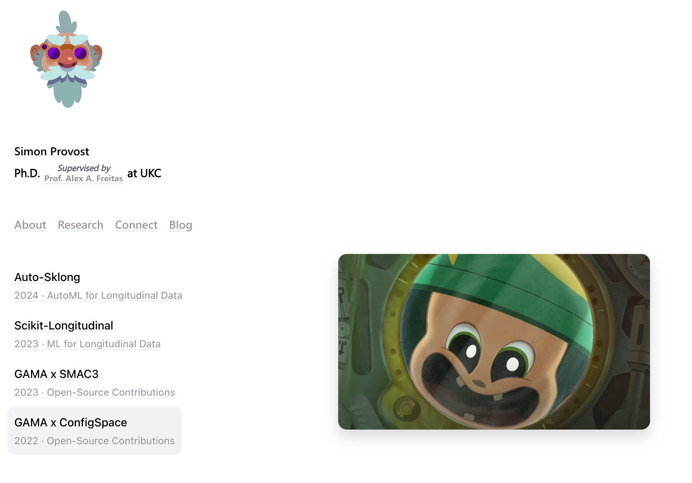

---

# 🚀 Minimalist Academia Portfolio Template

Welcome to my **crafted from scratch** Personal Portfolio & Academic Website Template! 🎉 
Whether your work is _academic_, _developer_, or _researcher_, this simple yet  
powerful template is meant to elegantly and effectively highlight your work.  
Inspired by [Nelson's elegant style](https://nelson.co/), this template showcases your projects,  
publications, and more with a clean, modern layout.

Feel free to **fork** this repository, **modify** it to fit your needs, and **deploy** your  
personalised host with ease! 🚀

---

## 🌟 Live Preview

Check out the live demo to see it in action:

🔗 [Live Preview](https://simonprovostdev.vercel.app/)

---

## 📦 Features

- **Minimalist Design 🖌️**: Clean and elegant layout to focus on your content.
- **Vercel Integration ⚡**: Seamlessly deploy your site with Vercel.
- **Analytics 📈**: Built-in Vercel Analytics and Speed Analytics.
- **Blog Integration 📝**: Fetch blog posts directly from a public Notion database.
- **Interactive Animations 🎨**: Engaging Rive animations for a dynamic user experience, including minimalist appearing animations and more.

---

## 🍴 **Fork, Modify & Deploy**

<details>
<summary>✨How to Fork</summary>

1. Click the **Fork** button at the top right of this repository.  
2. Clone the forked repository to your local machine:  
   ```bash
   git clone #the proposed link
   # e.g For me it would be: https://github.com/simonprovost/simonprovost.dev.git
   ```
3. Navigate to the project directory:  
   ```bash
   cd simonprovost.dev
   ```
</details>

---

## 🛠️ **Installation & Setup**

<details>
<summary>🔧Prerequisites</summary>

Make sure you have the following installed:

- [**Node.js**](https://nodejs.org/) (v14 or later)
- **npm** or [**Yarn**](https://yarnpkg.com/)

</details>

<details>
<summary>📥 Steps to Install & Deploy to Vercel</summary>

1. **Install Dependencies**  
   Run the following command to install all required packages:  
   ```bash
   npm install
   # or
   yarn install
   ```

2. **Run the Development Server**  
   Start the development server:  
   ```bash
   npm start
   # or
   yarn start
   ```  
   Open [http://localhost:3000](http://localhost:3000) to view it in your browser.  
   - The page will reload automatically when you make changes.

3. **Deploy to Vercel**  
   Deploy your application to Vercel in a few simple steps:  

   - **Install Vercel CLI** (if not already installed):  
     ```bash
     npm install -g vercel
     ```

   - **Login to Vercel**:  
     Authenticate your Vercel account:  
     ```bash
     vercel login
     ```

   - **Deploy the Project**:  
     Run the following command to deploy your project:  
     ```bash
     vercel
     ```

   - Follow the on-screen instructions to link your project to your Vercel account.

   - **Production Deployment**:  
     To deploy in production mode, use:  
     ```bash
     vercel --prod
     ```

   Your site will now be live, and Vercel will provide a deployment link like:  
   `https://yourprojectname.vercel.app/`
</details>

---

## 📂 Project Structure

Here's a detailed breakdown of the project's structure:

### **Public/**

- **Images/** 🖼️: Contains images used throughout the project.
- **rive/** 🎬: Holds Rive animation files (e.g., head tracking animations).
- **videos/** 🎥: Stores video assets used in the project.

### **src/**

#### **Components/**

- **AcademiaHeader** 🎓
  - Displays a header, allowing users to mention their academic supervisor.
- **BlogPost** 📝
  - Loads a specific blog post fetched via URL/ID.
- **PostList** 📚
  - Displays a list of posts (jobs/projects/papers) with titles, subtitles, and hover details.
- **RiveDownloadCV** 📄
  - Shows a book animation that downloads the CV when clicked.
- **RiveHeadTracking** 👤
  - Displays the head-tracking animation.
- **RiveLoader** ⏳
  - Shows a Rive-based loader animation.
- **SnakeEffect** 🐍
  - Adds a blurry snake-like effect to children elements.
- **SocialsList** 🔗
  - A minimalist list of social links without hover actions.

#### **Screens/**

- **About** 🧑‍🏫
  - Details your academic journey. *(You may need to rewrite this page.)*
- **Blog** 📰
  - Displays articles fetched from a Notion database. Fork mine [here](https://dramatic-radium-e1a.notion.site/).
- **Connect** 🤝
  - Shows connect links.
- **Credits** 🎖️
  - Displays a spiral-based credits screen.
- **OpenSource** 🌐
  - Showcases open-source projects with associated media.
- **Research** 🔬
  - Displays a list of papers with titles and abstracts on hover.

### **Configs/**

- **Configuration Files** 🛠️
  - Centralises all screen configurations for quick modifications without changing the core code. One config per screen.

---

## 🔍 Modifying the Project

To customise the project:

1. **Public Assets**: Add or modify images, animations, and videos in the `Public` folder.
2. **Components**: Update or create new components in the `src/Components` directory.
3. **Screens**: Customise each screen by editing files in the `src/Screens` directory.
4. **Configs**: Adjust configurations in the `Configs` folder to change screen settings without altering the codebase.

---

## 🛠️ Future Enhancements

- **Scholar Profile Integration** 📚:
  - Automatically fetch Scholar profiles, abstracts, and authors for the research screen, eliminating the need for manual configuration.

---

## 🤝 Open Source Contributions

I love collaboration! 🌟 Share your ideas, provide enhancements, and contribute to making this template even better. Feel free to open issues or submit pull requests.

# 🎉 Cheers!
## Happy Building! 🚀

---

## 📄 License

This project is licensed under the [MIT License](LICENSE).

---

## 📚 Reference

Inspired by [Nelson](https://nelson.co/) and built with [Create React App](https://github.com/facebook/create-react-app).

---

## Quick Start

```bash
# Clone the repository
git clone https://github.com/simonprovost/simonprovost.dev.git

# Navigate to the project directory
cd simonprovost.dev

# Install dependencies
npm install
# or
yarn install

# Start the development server
npm start
# or
yarn start
```

👀
